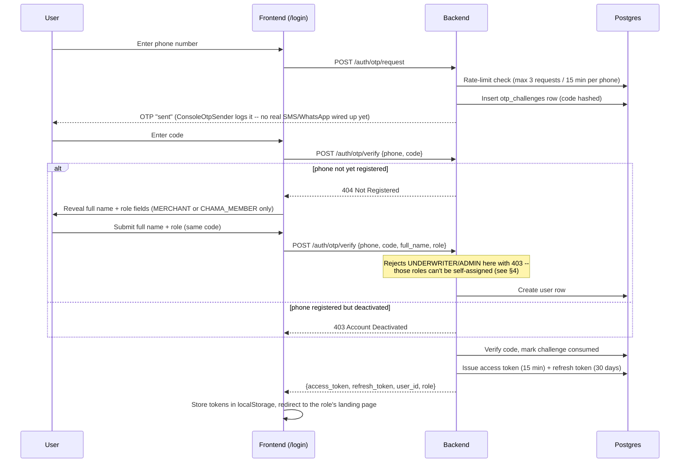
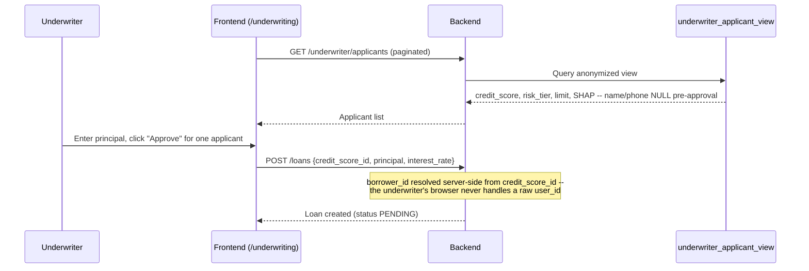
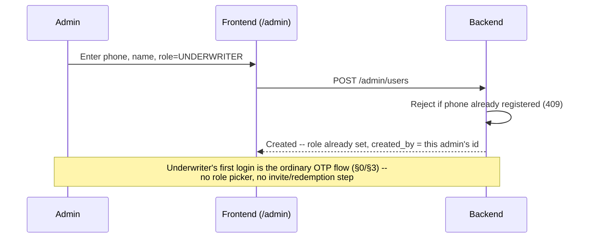

# User Journeys — DukaCred

**Companion to:** [`TECHNICAL_DESIGN.md`](./TECHNICAL_DESIGN.md) (v1.5)

This document describes how each of the four user roles actually moves through the platform as built — not aspirational flows, but what the current frontend pages and backend endpoints do today. Where the real behavior has a known gap or rough edge, it's called out inline rather than glossed over.

**On self-onboarding (as of TDD v1.4):** `MERCHANT` and `CHAMA_MEMBER` are self-onboarding by design — frictionless signup for credit-invisible people is the point of the product. `UNDERWRITER` and `ADMIN` are **not** self-onboardable: those roles carry access to the applicant view and loan approval, and letting anyone self-select into them at signup would be a straightforward privilege-escalation path, not a legitimate onboarding flow. See §4 below for how those two roles actually get created.

---

## 0. Shared: Sign-Up & Login (MERCHANT / CHAMA_MEMBER)

There is no separate registration form and no password. A merchant or chama member signs in the same way; the role is chosen once, at first login, and there's currently no self-service way to change it afterward. (`UNDERWRITER`/`ADMIN` accounts skip this entirely — see §4.)



**Notes on what's real here:**
- The OTP code is only ever visible in the backend's logs in this build (`docker compose logs backend | grep OTP`). There's no SMS/WhatsApp provider — `ConsoleOtpSender` is a single swappable class, documented as the one thing to replace before a real deployment.
- A wrong code counts against a 5-attempt lockout per challenge; a new code must be requested after that.
- Session tokens live in `localStorage`, not an HttpOnly cookie — a deliberate dev-mode simplification (see TDD §8.2) because the frontend and backend run on different local ports. In production, a Firebase Hosting rewrite is planned to make them same-origin so the HttpOnly cookie design can actually be used.
- Refresh tokens are single-use and rotate on every `/auth/refresh` call. If an already-rotated refresh token is presented again (a replay/theft signal), the entire session's token family is revoked and the user is forced to log in again. The frontend's `apiClient` handles a 401 transparently: it attempts one silent refresh-and-retry before giving up and redirecting to `/login`.
- A deactivated account (see §4) hitting this flow gets a clear "account deactivated" message rather than being silently treated as brand-new and shown the registration form again.
- After login, the frontend redirects to the role-appropriate landing page (`/ledger` for MERCHANT, `/chama` for CHAMA_MEMBER, `/underwriting` for UNDERWRITER, `/admin` for ADMIN) rather than always landing on `/ledger`.
- **Known gap:** nothing currently lets a user recover access if they lose their phone number, and there's no account-merge or role-change-by-self flow (an admin can change a user's role via §4, but the user can't request it themselves).

---

## 1. MERCHANT Journey

A merchant runs a *duka* (kiosk/shop). After login they land on `/ledger`. The dashboard nav shows **Duka Ledger** and **Chama Portal** (a merchant can also participate in a chama), but not **Underwriting**.

### 1.1 Recording the day's business

On `/ledger`, the "Record transaction" panel lets them log a **Sale**, **Expense**, or **Supplier payment**:

- Every submission carries a fresh `Idempotency-Key` header generated client-side. If the request times out on a flaky connection and the app retries automatically, the backend recognizes the retry and returns the original result instead of creating a second real transaction.
- **A Sale requires picking a real product and quantity** (as of TDD v1.5) — the form won't let a sale through without one, and the backend independently rejects a sale with no line items (422) regardless of what the frontend sends. This closes what was previously the cheapest way to fabricate `sales_velocity`: recording an arbitrary amount with no corresponding inventory movement to cross-check against. A sale can also optionally be marked "sold on credit" with a customer phone number attached.
- The referenced product must actually belong to the merchant recording the sale — same for restocking. Both are rejected (403) otherwise, closing a gap where a merchant could previously reference or restock *another* merchant's inventory.
- Every transaction — regardless of type — gets appended to that merchant's single SHA-256 hash chain (`duka_transactions`), with a monotonic `sequence_no`. The chain's integrity is enforced by a database trigger, not just application code: an insert with a broken `previous_hash` link is rejected outright, and `UPDATE`/`DELETE` on this table are blocked entirely. **Important:** this proves a row wasn't edited or deleted after the fact — it does not prove the sale was real. Requiring a real, owned product line item is what ties the number to something checkable; the hash chain alone never did that.
- The "Recent transactions" table is paginated (50 per page, Previous/Next controls) rather than loading the merchant's entire history at once.

### 1.2 Inventory

The "Products & inventory" panel lets them add a product (name, unit cost, unit price) and restock it by quantity. Restocking inserts an `inventory_movements` row; a database trigger keeps `products.quantity_on_hand` in sync automatically — the application never has to remember to update both in the same transaction. Overselling below zero stock is rejected by a `CHECK` constraint.

### 1.3 Checking their own credit score

At the bottom of `/ledger`, a "Your credit score" card shows the merchant's most recent score (300–850), risk tier badge, and recommended limit, plus a bar breakdown of which behavioral features pushed the score up or down (SHAP values — sales velocity, receivables days, chama punctuality, margin stability). Hitting "Re-evaluate" calls `POST /scoring/evaluate/{user_id}`, which recomputes the four features live from their ledger and chama data and runs them through the trained model.

- The score is cached (Redis, bucketed feature values) but the cache is invalidated immediately on any new sale, expense, or chama contribution — a merchant who just made a sale and re-evaluates will not see a stale six-hour-old number.
- `margin_stability` is computed over the same rolling 30 days as `sales_velocity` (as of v1.5, previously all-time) — a one-off burst of transactions decays out of the score instead of permanently skewing it.

### 1.4 Chamas

A merchant can also open `/chama` and participate exactly as a `CHAMA_MEMBER` would (§2 below) — creating a chama makes them its `CHAIRPERSON`.

### 1.5 Loans

A merchant's loans exist server-side (`GET /loans/mine`, paginated) but **there is currently no frontend page for a merchant to view their own loan status or repayment history** — this is backend-complete, frontend-incomplete. Worth prioritizing if merchant-facing loan visibility matters for the pilot.

**Known gap:** role is only enforced in the frontend's navigation (a merchant simply isn't shown a link to `/underwriting`). The backend does not check role on the ledger or chama endpoints beyond requiring *some* valid login — only `/loans` (create) and `/underwriter/applicants` actually enforce `UNDERWRITER`. This is a UI convenience today, not an authorization boundary.

---

## 2. CHAMA_MEMBER Journey

A pure savings-circle participant with no shop of their own. After login, the nav shows only **Chama Portal**.

```mermaid
sequenceDiagram
    participant U as Chama Member
    participant F as Frontend (/chama)
    participant B as Backend

    U->>F: Create chama (name, WEEKLY/MONTHLY cycle, amount)
    F->>B: POST /chama/groups
    B-->>F: New chama; creator becomes CHAIRPERSON
    U->>F: Add member by user_id
    F->>B: POST /chama/groups/{id}/members
    U->>F: Select a member row
    F->>B: GET /chama/members/{id}/punctuality
    B-->>F: on-time % (on-time contributions / total)
    U->>F: Record a contribution (due date, amount due, amount paid)
    F->>B: POST /chama/contributions
    Note over B: Rejects if the recorder IS the member being credited,<br/>or isn't an officer of this chama (v1.5)
    B->>B: is_on_time = paid_at date <= cycle_due_date
```

- The chama list and member list on the page are both paginated.
- `is_on_time` is computed server-side, not left to the client, and a `UNIQUE(member_id, cycle_due_date)` constraint stops a double-submitted contribution from silently inflating or deflating the punctuality percentage.
- **Duty separation (as of TDD v1.5):** only a `CHAIRPERSON`, `TREASURER`, or `SECRETARY` of *that specific chama* can record a contribution, and never for themselves. Previously any authenticated user could record any member's contribution, including their own — a member could self-attest their own on-time payment, fabricating the `chama_punctuality` feature that feeds credit scoring. The frontend shows a clear message if this is rejected rather than a bare failed request. **Known consequence:** a chama with only one officer has no one who can record that officer's own contribution — a second officer needs to be added first.
- **Known gap:** there's a backend repository method for listing a member's full contribution history and for listing scheduled merry-go-round payouts, but neither has a `GET` endpoint or frontend UI exposed yet — a member can record and see their punctuality %, but not browse a contribution ledger or payout schedule.

---

## 3. UNDERWRITER Journey

Represents MFI/lender staff. After login, the nav shows only **Underwriting**.

**How they got an account in the first place:** unlike merchants and chama members, an underwriter never signs themselves up. An admin creates their account via `/admin` (see §4) with their phone number, name, and `role: "UNDERWRITER"` already set. Their first login is then just the ordinary OTP flow in §0 — no role picker appears, because the role was already assigned.



- The applicant table is deliberately anonymized: `applicant_name`/`applicant_phone` stay `null` until a loan's status reaches `APPROVED`, `DISBURSED`, or `REPAID`. An underwriter evaluating a fresh applicant sees only their score, tier, recommended limit, and SHAP breakdown — not who they are.
- Approving a loan only requires a principal amount in the current UI; **interest rate is hardcoded to 5% client-side** rather than being an input — a placeholder, not a real underwriting control yet.
- **Known gap:** `POST /loans/{id}/repayments` exists on the backend (recording a repayment against a loan) but has no frontend UI — an underwriter can approve a loan but can't record its repayments through the app today.
- **Known gap:** there's no UI for `MANUAL`/`OVERRIDE` underwriting (a loan not backed by an algorithmic score) even though the backend supports it — the frontend only ever sends `underwriting_method: "ALGORITHMIC"`.

---

## 4. ADMIN Journey

Represents whoever operates the platform for a given deployment — onboards underwriters, manages accounts. After login, the nav shows only **Admin**.

### 4.1 Getting the very first admin account

There's a chicken-and-egg problem: an admin normally onboards other privileged accounts, but the first admin has no one to onboard *them*. That's solved out-of-band, not through the app:

```bash
docker compose exec backend python -m scripts.create_admin --phone +254712345678 --name "Jane Admin"
```

This inserts the row directly against the database (the same thing `POST /admin/users` does under the hood, minus the "who's calling" check, since there's no admin yet to satisfy it). Running it again for an already-registered phone number is a safe no-op — it reports the existing account instead of creating a duplicate. From here on, every subsequent admin or underwriter is created through the app by this admin, not the script.

### 4.2 Onboarding an underwriter



### 4.3 Managing existing users

The `/admin` page's user table lists every account (paginated, filterable by role, with a toggle to include deactivated ones) and supports, per row:

- **Edit** — change a user's full name or role inline.
- **Deactivate** — soft-deletes the account (`deleted_at`) and immediately revokes every refresh token they currently hold, so they can't silently keep minting new access tokens off an already-issued refresh token. Their login attempts afterward get a clear "account deactivated" message (§0) instead of being treated as a new signup.
- **Reactivate** — clears `deleted_at`; the account can log in normally again on its next attempt.

**Deliberately not built:** a "reset password" action. This is OTP-only auth — there's no password to reset. Deactivate is the equivalent for "lock this account out right now."

**Known gap:** there's no audit log beyond `users.created_by` (who onboarded a given account) — role changes and deactivations aren't independently logged with a timestamp/actor beyond what's visible by re-fetching the user list.

---

## Cross-Cutting Gaps Worth Tracking

These aren't blockers for a pilot demo, but they're the honest list of what a real underwriting or merchant-facing operation would need next:

| Gap | Where it bites |
| --- | --- |
| No merchant-facing loan/repayment view | A merchant has no way to see their own loan status or what they owe |
| No repayment-recording UI | An underwriter can approve a loan but not log payments against it |
| No MANUAL/OVERRIDE underwriting UI | Every loan today is forced through the algorithmic path |
| No contribution-history or payout-schedule UI | Chama members can't review past contributions or upcoming merry-go-round payouts |
| Role enforcement is nav-only outside of `/loans`, `/underwriter/applicants`, and `/admin/*` | A logged-in `UNDERWRITER` account could call ledger/chama endpoints directly (self-assigning *into* that role is fixed as of v1.4 — see §4 — but role-scoping on unrelated endpoints is still nav-only) |
| No account recovery / self-service role change | Losing access to the registered phone number has no recovery path; a user can't request a role change themselves (an admin can do it for them via §4) |
| Interest rate is hardcoded in the frontend | Not a real underwriting input yet |
| No admin action audit log | Beyond `users.created_by`, role changes and deactivations by an admin aren't independently logged with a timestamp/actor |
| Scoring inputs are entirely self-reported | Nothing corroborates a sale, restock, or contribution against an external source (mobile-money settlement, bank statement) — the v1.5 fixes close the cheapest fabrication paths but don't solve this at the root |
| Merchant controls the timing of their own score evaluation | A fabricate-then-immediately-evaluate pattern within the 30-day window isn't detected |
| `receivables_days` proxy is still gameable | A fabricated follow-up transaction under a made-up `customer_phone` can still make a credit sale look promptly collected (§5.1's documented gap) |
| No anomaly/fraud-risk signal shown to underwriters | A suspicious pattern (sudden volume spike, implausibly smooth margin) isn't flagged alongside the score — it's presented as clean and final either way |
